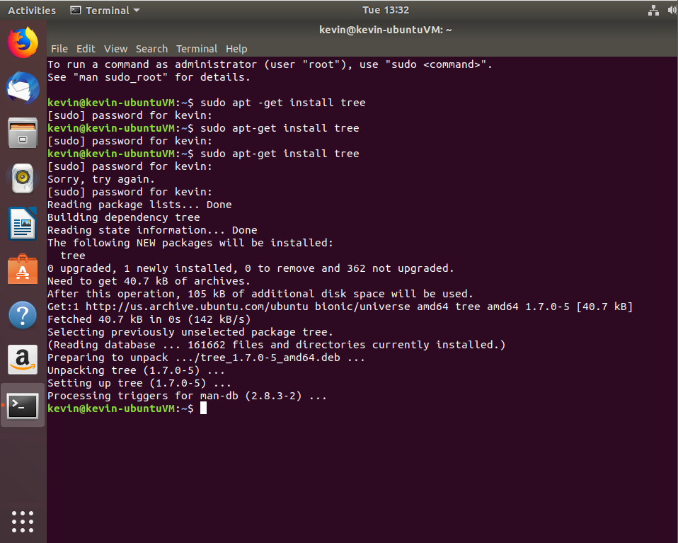
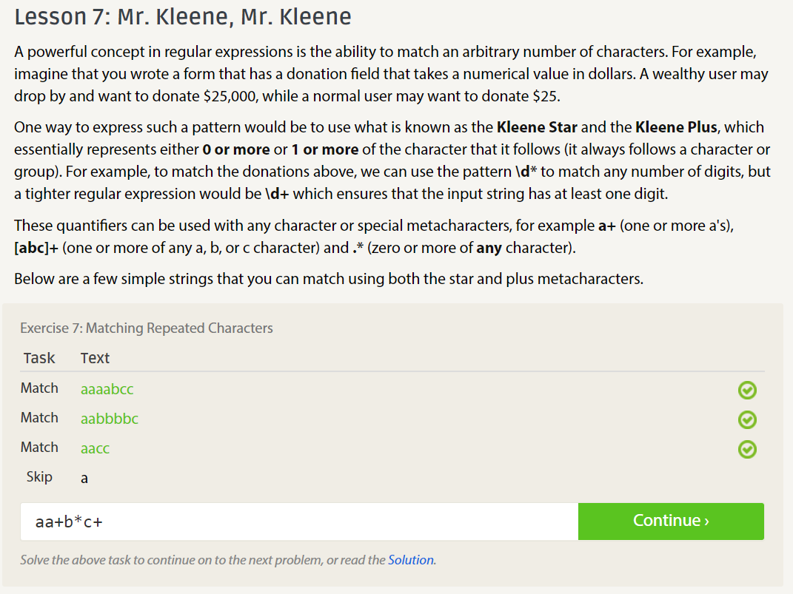
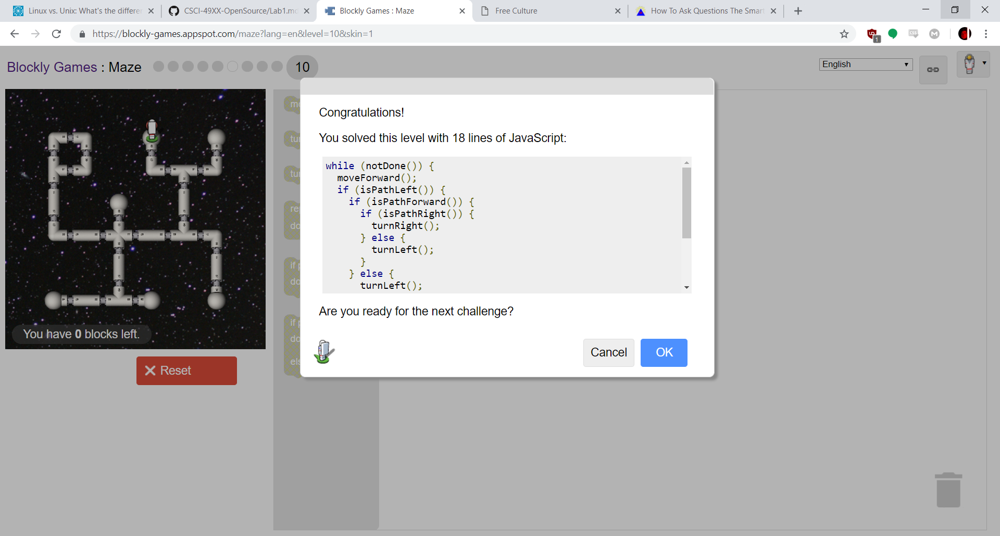

Part C
------
Core Components of Open Source: https://opensource.org/osd
 - Source code accessable.
 - Derivatives works must be equally accessable.
 - Original work is preserved as completely independent of any deriviatives.
 - Personal views cannot effect who can modify or use your works.
 - Works cannot restrict other works packaged with it.

Asking Smart Questions: http://www.catb.org/esr/faqs/smart-questions.html
 - Providing clear and concise explainations of what help you need it better than just saying you're lost.
 - If you are just lost and need help, being very polite and appreciative can get you far enough to be able to ask useful questions.

Part D
------
Ubuntu Screenshot 

Part E
------
Regex Screenshot 

Part F
------
Blockly Screenshot 

Part G
------
