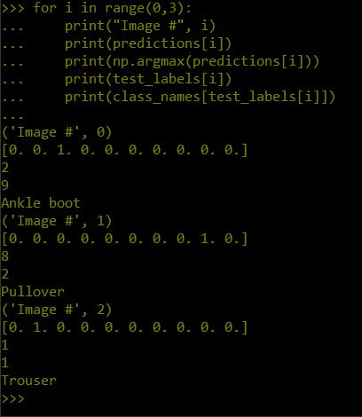
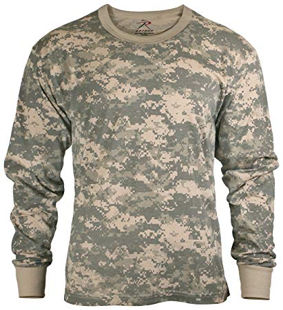
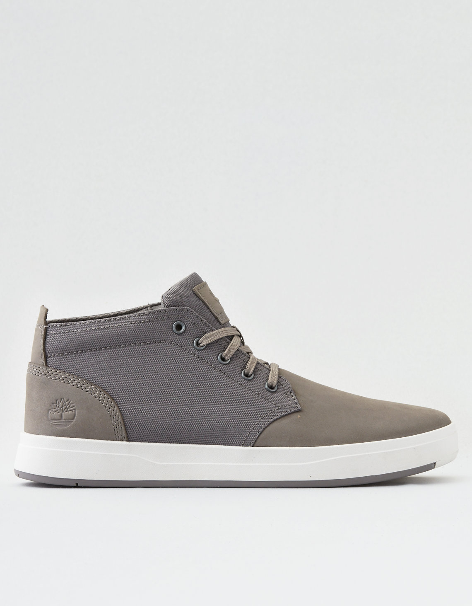
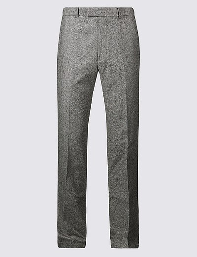

# Checkpoint 1

# Checkpoint 2

check out check2.py for script run in python terminal

# Checkpoint 3

Prediction: "Ankle boot"
wrong

Prediction: "pullover"
wrong again

Prediction: "Trouser"
Correct