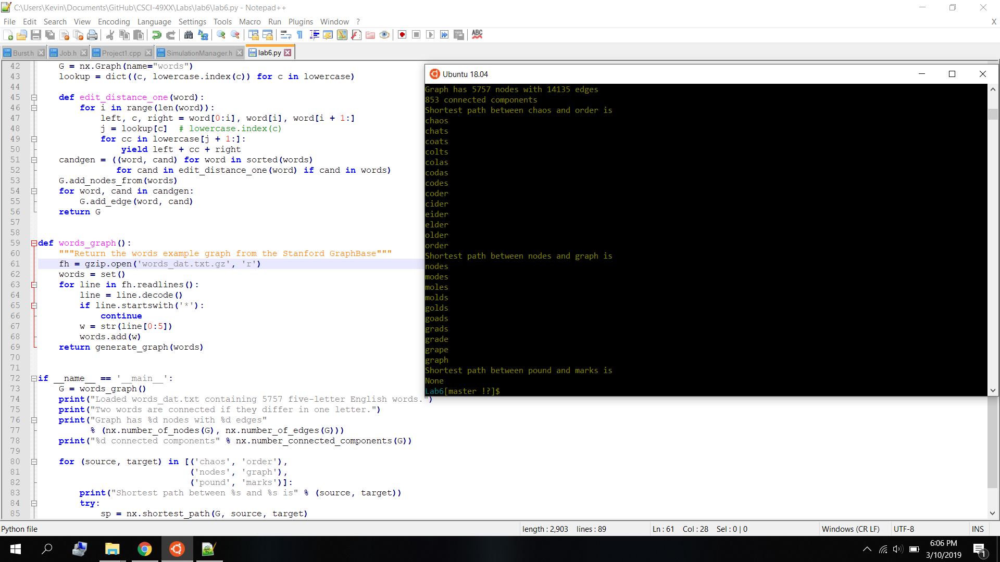
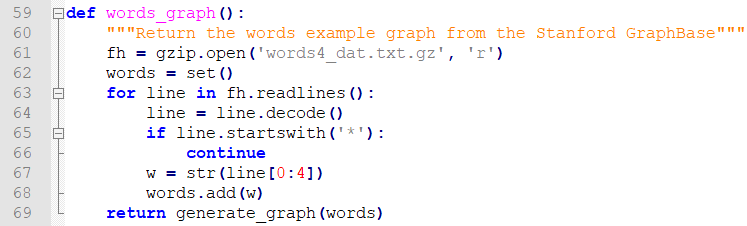
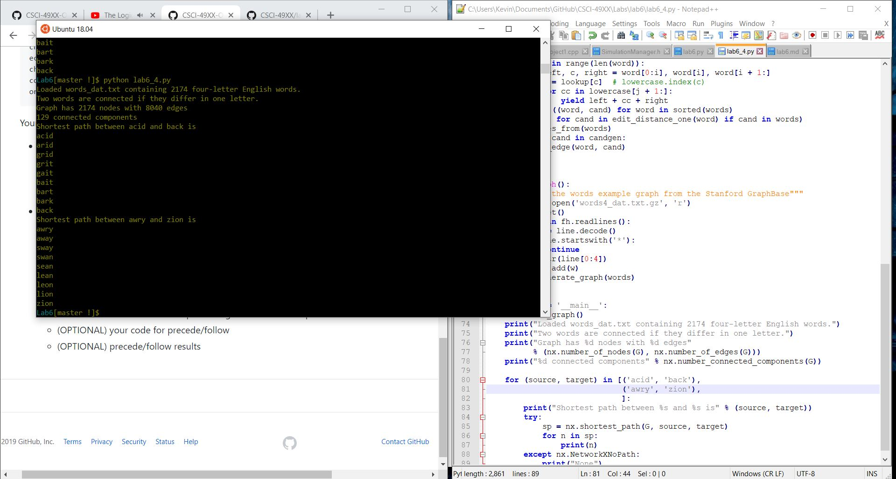
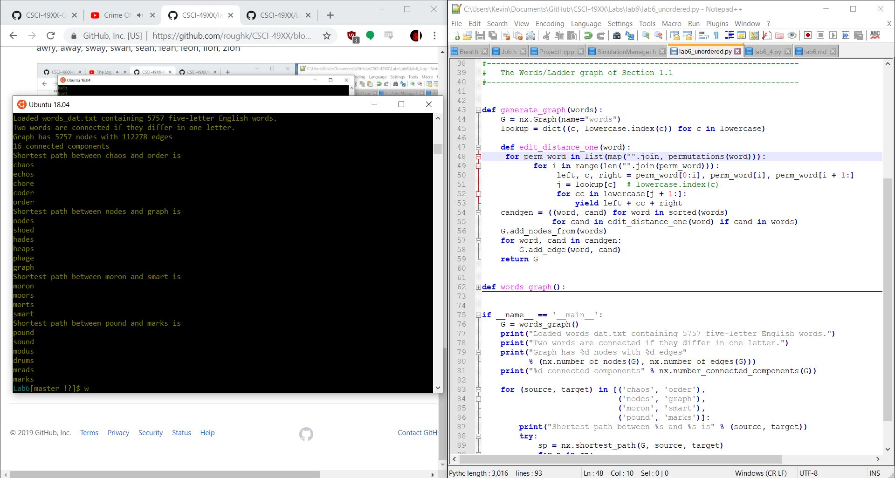

# Five Letter Results

Shortest path between chaos and order is
-
chaos,
chats,
coats,
colts,
colas,
codas,
codes,
coder,
cider,
eider,
elder,
older,
order

Shortest path between nodes and graph is
-
nodes,
modes,
moles,
molds,
golds,
goads,
grads,
grade,
grape,
graph

Shortest path between moron and smart is
-
moron,
boron,
baron,
caron,
capon,
capos,
capes,
canes,
banes,
bands,
bends,
beads,
bears,
sears,
stars,
start,
smart

Shortest path between pound and marks is
-
None

# Four Letter Results

Shortest path between acid and back is
-
acid,
arid,
grid,
grit,
gait,
bait,
bart,
bark,
back

Shortest path between awry and zion is
-
awry,
away,
sway,
swan,
sean,
lean,
leon,
lion,
zion

# Five Letter Unordered Results

Shortest path between chaos and order is
-
chaos,
echos,
chore,
coder,
order

Shortest path between nodes and graph is
-
nodes,
shoed,
hades,
heaps,
phage,
graph

Shortest path between moron and smart is
-
moron,
moors,
morts,
smart

Shortest path between pound and marks is
-
pound,
sound,
modus,
drums,
mrads,
marks

