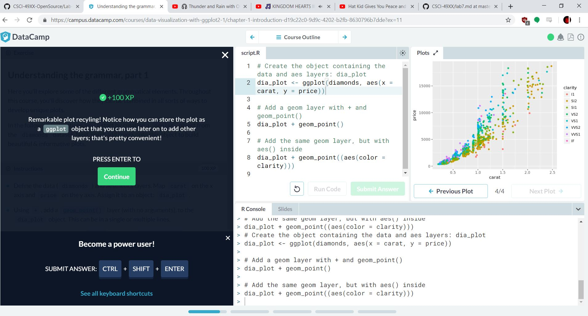
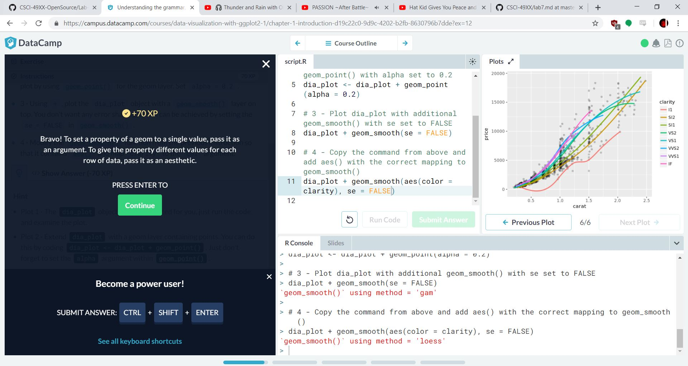

#PROJECT

https://rcos.io/projects/schedj/schedj-frontend/profile

Schedj is an application designed to do two functions:
Log into and interact with RPI SIS system
Create, modify, and submit schedules to SIS for an easier and faster class sign up procedure
This week, I discussed ideas for logo assets to be used in the app and as the application icon.
Three ideas were created with varrying levels of enthusiasm.
(P. Turner if you're reading this you know that the vaporwave logo was certainly the best)
Some bugs, missing features, and other improvements were dicussed and documented.
User QOL is one of the highest priorities.